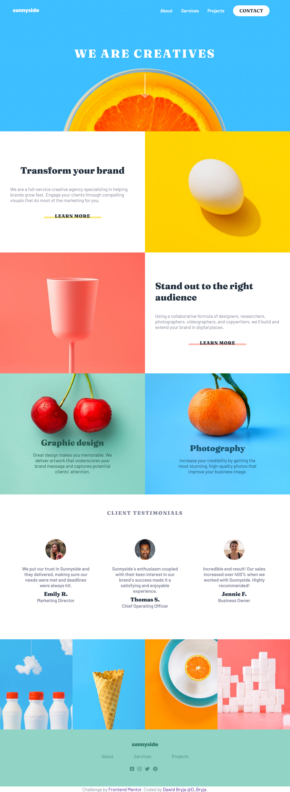

# Frontend Mentor - Sunnyside agency landing page solution

This is a solution to the [Sunnyside agency landing page challenge on Frontend Mentor](https://www.frontendmentor.io/challenges/sunnyside-agency-landing-page-7yVs3B6ef).

## Table of contents

- [Overview](#overview)
  - [Screenshot](#screenshot)
  - [Links](#links)
- [My process](#my-process)
  - [Built with](#built-with)
  - [What I learned](#what-i-learned)
  - [Continued development](#continued-development)
- [Author](#author)

### Screenshot



### Links

- Solution URL: [https://github.com/DBryja/Sunnyside-Agency.git]
- Live Site URL: [https://dbryja.github.io/Sunnyside-Agency/]

## My process

### Built with

- Mobile-first workflow
- Semantic HTML5 markup
- CSS
- Flexbox

### What I learned

It was my first time using different images for different media sizes

```html
<picture>
  <source srcset="./images/desktop/image-transform.jpg" media="(min-width: 768px)" />
  
</picture>
```
### Continued development

Propably a lot of space for improvement, especially in minimizing the amount of css.

## Author

- Frontend Mentor - [@DBryja](https://www.frontendmentor.io/profile/DBryja)
- Twitter - [@D_Bryja](https://www.twitter.com/D_Bryja)
